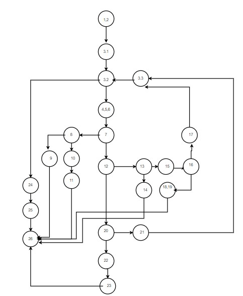

# SI_lab2_196014_
Втора лабораториска вежба по Софтверско инженерство\
Тијана Атанасовска 196014
1. control flow graph\
\
2.Цикломатска комплексност\
Пресметување со формулата: Број на ребра – број на јазли + 2
Цикломатска комплексност = 30 – 24 + 2 = 8 \
Пресметување со формулата: Број на јазли кои се гранат + 1 \
Цикломатска комплексност = 7 + 1 = 8 \
3.Тест случаи според критериумот Multiple Condition\
Ги анализираме if statements во кои има повеќе од 1 услов.
Услов: if (hr < 0 || hr > 24)\
(-1,2,2)\
(25,2,2)\
(3,2,2)\
Услов: if (min < 0 || min > 59)\
(23,-2,2)\
(23,62,2)\
(3,2,2)\ 
Услов: if (sec >= 0 && sec <= 59)\
(23,2,62)\
(23,2,-2)\
(3,2,2)\ 
Услов: else if (hr == 24 && min == 0 && sec == 0)\
(24,0,0)\
(24,2,0)\
(24,0,2)\
*Не постои тест случај за FXX*
4.Тест случаи според критериумот every branch\
(1,2,2)\ 
(-1,2,2)\
(26,2,2)\
(23,-2,2)\ 
(23,2,-2)\ 
(24,0,0)\ 
(24,2,2)\ 
[] //Празна листа е исто така тест случај
5.Објаснување на напишаните unit tests\
Две функции за да се опфатат двата критериуми : eachBranch,MultipleCondition. Во секој од нив, доколку треба да врати листа се имплементира  листа со точниот резултат во неа и се повикува assertEquals(result, lab.function(list));\
За тест случајот со празна листа assertTrue(result.isEmpty());\
За тест случаите каде треба да се фрли исклучок, решението е со try catch блок и потоа споредување на пораката која ја носи исклучокот.

