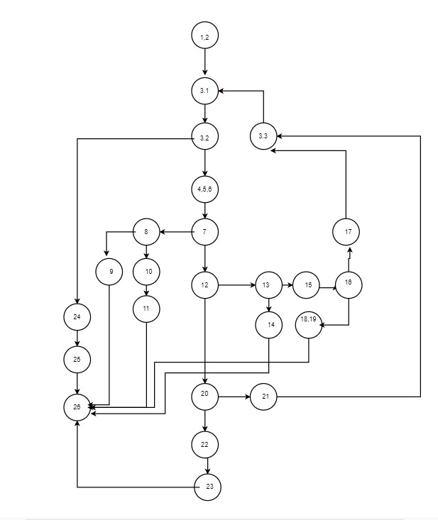

# SI_lab2_196014_
Втора лабораториска вежба по Софтверско инженерство\
Тијана Атанасовска 196014
1. control flow graph\
\
2.Цикломатска комплексност\
Број на ребра – број на јазли + 2 = 30 – 24 + 2 = 8 \
3.Тест случаи според критериумот Multiple Condition\
(-1,2,2)\
(25,2,2)\
(3,2,2)\
(23,-2,2)\
(23,62,2)\
(23,2,62)\
(23,2,-2)\
(24,0,0)\
(24,2,0)\
(24,0,2)\
4.Тест случаи според критериумот every branch\
(1,2,2)\
(-1,2,2)\
(26,2,2)\
(23,-2,2)\
(23,2,-2)\
(24,0,0)\
(24,2,2)\
5.Објаснување на напишаните unit tests\
Три функции за да се опфатат двата критериуми и нормален тек дополнително: normalFlow,eachBranch,MultipleCondition. Во секој од нив, доколку треба да врати листа се имплементира  листа со точниот резултат во неа и се повикува assertEquals(result, lab.function(list));\
За тест случаите каде треба да се фрли исклучок, решението е со try catch блок и потоа споредба на пораката која ја носи исклучокот.

